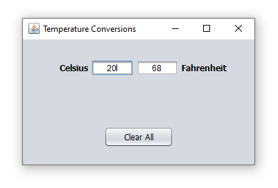

# Celsius - Fahrenheit Conversions in java

This is a simple educational tool which can be used to convert Celsius to Fahrenheit and Fahrenheit to Celsius.
 Swing library was used and NetBeans IDE.

## 📝 License

The project is available as open source under the terms of the MIT License.

- **[MIT license](http://opensource.org/licenses/mit-license.php)**
- Copyright 2020 © <a href="https://github.com/NasosG" target="_blank">NasosG</a>.